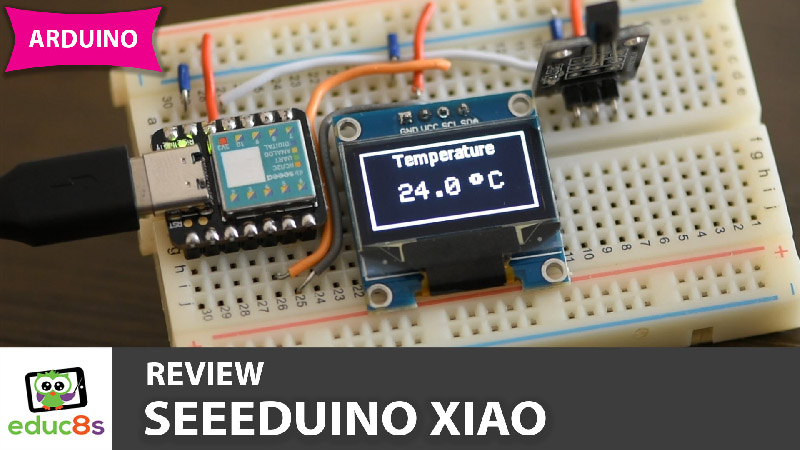

# Seeeduino-Xiao (Arduino Compatible)-Temperature-Monitor-with-OLED-display
This is a simple temperature monitor using the Seeeduino Xiao, an Arduino Compatible board. It uses an SSD1306 OLED display and a DS18B20 temperature sensor.

  

🎥 [Watch the video on YouTube](https://www.youtube.com/watch?v=-nECx4DOE84)

# Parts Needed
🛒 Arduino Xiao: http://educ8s.tv/part/xiao

🛒 SSD1306 OLED: http://educ8s.tv/part/OLED096

🛒 DS18B20 Temperature Sensor: http://educ8s.tv/part/DS18B20

🛒 Breadboard: http://educ8s.tv/part/SmallBreadboard

🛒 Wires: http://educ8s.tv/part/Wires

💖 Full disclosure: All of the links above are affiliate links. I get a small percentage of each sale they generate. Thank you for your support!

# Schematic Diagram

  

# Credits & Thanks

  - Kudos to [Adafruit Industries](https://github.com/adafruit) for being the creator of the display libraries without which this project would not exist.

